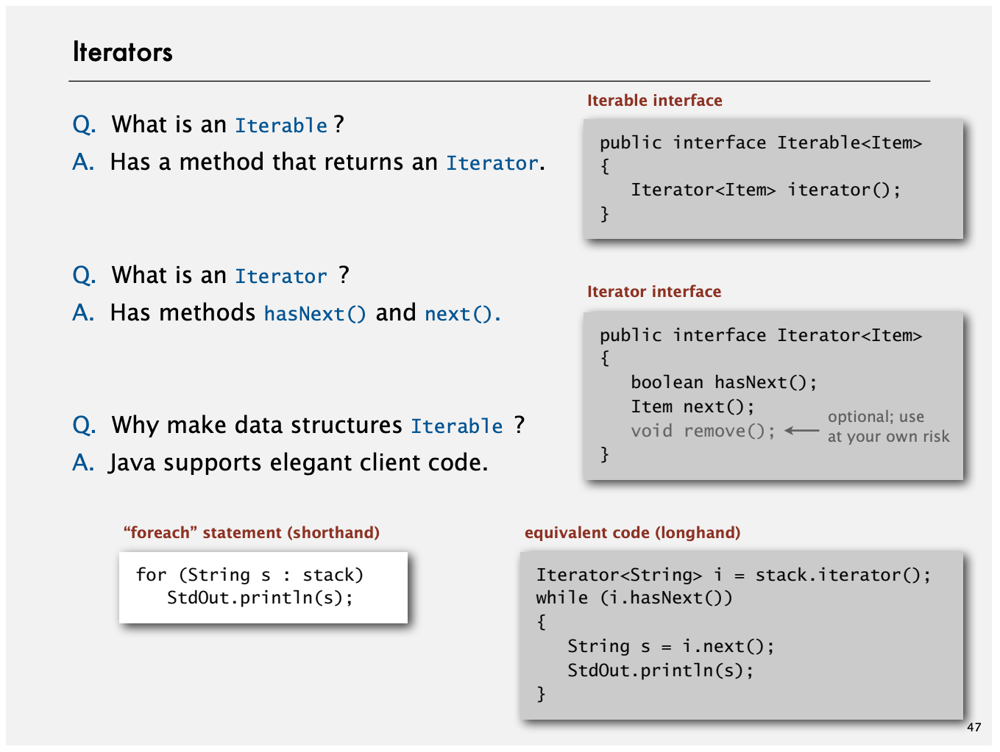

## 迭代器

迭代器设计模式的实现，




只有有顺序的容器实现 Iterator 才有意义，List 用索引顺序来访问，Set 会以一种随机的方式遍历元素。

##### 迭代器的位置移动和 Remove

迭代器初始指向第一个元素，遍历结束后指向最后一个元素。

- Iterator 的remove 方法会删除上次 next 返回时的元素。也就是当前迭代器位置之前的元素。删除之前先看一下这个元素也是有意义的。

  下面 code 删除集合中第一个元素

  ```java
  Iterator<String> it = c.iterator();
  it.next();
  it.remove();
  ```

- 问题：
  - Collection已经有remove(xx)方法了，为什么Iterator迭代器还要提供删除方法呢？
  - 为什么不能用 foreach 语法遍历时候删除元素？ 或者  为什么要提供remove 方法。 
  - 为什么remove 设计成next越过这个元素才可以删除？
  - 为什么不添加 Add 方法。为什么 Iterator 又添加了add 方法。

```java
1. 提供边遍历边删除的策略。
2，3. 通过这种设计，可以确保删除操作不会影响到迭代器后续的遍历过程。当你调用 next() 方法时，迭代器会将游标移动到下一个元素，这时才可以安全地执行删除操作，因为删除的元素不会影响到当前迭代器位置之前的元素。

4. 添加元素可能会影响迭代器的遍历过程，因此在遍历过程中修改集合的结构是一个容易导致错误的做法。ListIterator允许你在迭代器当前位置之前插入一个元素，而不影响迭代器后续的遍历过程。只有对自然有序的集合使用迭代器添加元素才有实际的意义。
```


### 特定实现

#### ListIterator

```java
public interface ListIterator<E> extends Iterator<E> {
    // Query Operations
    
    boolean hasNext();

    E next();

    boolean hasPrevious();

    E previous();

    int nextIndex();
    
    int previousIndex();


    // Modification Operations

    void remove();

    void set(E e);

    void add(E e);
}
```


[ListIterator 的文档](https://docs.oracle.com/javase/tutorial/collections/interfaces/list.html#:~:text=Iterators,it.add(e)%3B%0A%20%20%20%20%20%20%20%20%7D%0A%20%20%20%20%7D%0A%7D)


- next 的模式下，可以用 键盘的 Baskspace 类比 remove ，previous模式下，可以用 delete 类比 remove。
