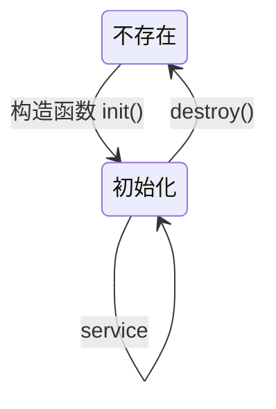
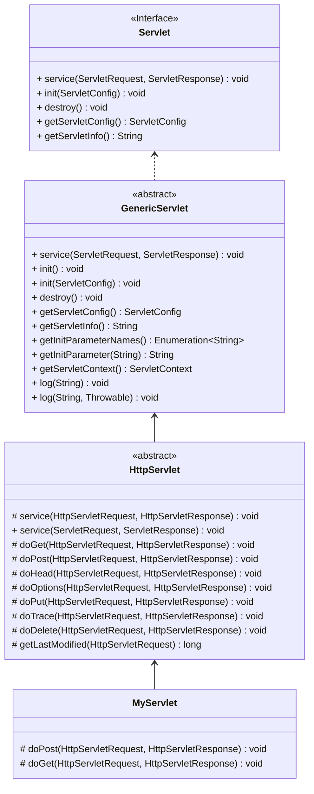
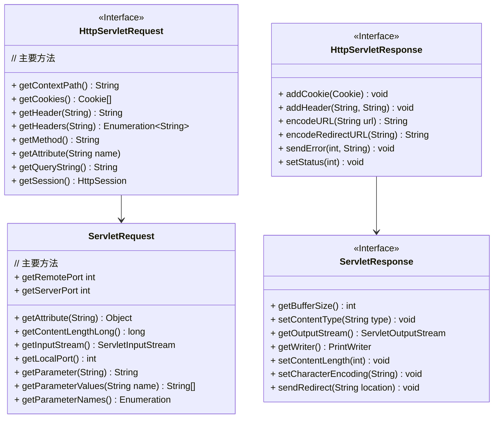

### Web 体系结构

### MVC

业务逻辑和表示分离，实际上，业务逻辑甚至根本不知道有表示的存在。

模型-视图-控制器

**模型**：包含具体的业务逻辑的状态，换句话说模型知道用什么规则来得到和更新状态。例如购物车的内容（和处理购物车内容的规则）就属于 MVC 中的模型。
系统中只有这部分于数据库通信。

**视图**：负责表示方面，他从控制器得到模型状态。另外视图还需要获得用户的输入，并交给控制器。

**控制器**：从请求获取用户输入，并明确这些输入对模型有什么影响。告诉模型自行更新，并让视图能得到新的模型的状态。

> 这是因为业务逻辑（处理数据的规则）会经常变化。


开发工作流

- 开发环境。

- 组织开发目录结构。

### Servlet 概述

**Q：描述 Servlet 的生命周期作用和事件序列：**

Servlet 主要存在一个状态：初始化。要么正在初始化，要么就不存在。

```
         请求
Web客户端 -----> Servlet容器（web 容器）
               |
               |------> 加载 AServlet.class (如果尚未加载)
               |
               |------> init() (仅首次)
               |                    
               |------> service() ----> doGet() / doPost() (根据请求类型)
               |
               |------> destroy() (当需要销毁Servlet时)
```

当请求来到时候，Web 容器为这个请求创建或者分配一个线程，并实例化一个Servlet 对象。调用 Service方法，Service根据请求类型 调用对应的HTTP方法。Service方法结束后，销毁Servlet对象。

> 参考自 ：Head first Servlet and jsp 第 97 页 + chatgpt 转化


**状态机**



Web 的通信模型可以简单抽象为**请求响应**模型，Web 容器通过 Servlet 的 Service 线程作为处理逻辑，围绕 请求/响应 进行处理。


##### Servlet 的具体实现细节





- `GenericServlet` 、`HttpServlet` 都是抽象类。
- `HttpServlet`  实现的 `service(HttpServletRequest, HttpServletResponse) void` 并不是 `service(ServletRequest, ServletResponse) void` 方法。

调用时序图

- 三个维度 ： 何时调用、作用、是否覆盖。

- 每个请求都会在单独的线程处理。每个请求都是  init() => service() => doGet/doPost  调用栈。

- 一个 `Servlet` 类在Web容器中（或JVM中）只有一个实例。容器会运行多个线程来处理对一个servlet的多个请求。

  > 可能有所谓 【每个 Servlet 实例】的表达，这实例上是不同的 `Servlet` 类 。


### 请求和响应

### HTTP

最基本的报文

请求报文

响应报文

浏览器怎么看

curl怎么看

六种请求方法

Get 和 Post 的区别

幂等的概念，哪些方法是幂等的？（规范）




Service 方法根据 HTTP 请求方法确定运行 doGet 还是 doPost。实际开发也只关注 Get 和Post 请求。

doGet : 针对简单请求，doPost 来接受和处理表单数据。

HttpServlet  是 HTTP 协议的具体实现，例如实现了 doXXX 的方法。这些 doXXX 方法。


#### 请求


#### 响应

响应： 浏览器得到、解析并呈现给用户的东西。

Q: **响应具体能做什么？**

大多数情况下，使用响应对象是为了向客户端（浏览器）发回数据。具体就是使用响应对象（HttpServletResponse）得到一个输出流，使用输出流写出HTML（或者其他数据）返回给客户端。

具体是：

```java
response.setContentType("text/html");
PrintWriter writer = response.getWriter();
ServletOutputStream outputStream = response.getOutputStream();
```

还可以使用响应设置响应首部，发送错误以及增加cookie。

##### 重定向

重定向有两种方式。

- **浏览器重定向**：

  如果你不想对一个请求做出响应，可以把请求重定向到另一个URL。浏览器会负责把新请求发送到你提供的URL。

  请求重定向发生在客户端，客户端收到的响应报文的状态码 30x，以及一个指向新位置的`Location`头。对应到 Servlet 操作是：

  ```java
  response.sendRedirect("https://xxxx");
  
  response.sendRedirect("根路径"); # 相对于web容器的根。
  response.sendRedirect("相对路径"); # 相对于 URL 路径。
  ```

- 请求分派，发生在服务端。请求分派就是把请求传递给服务器的另一个组件。

  ```
  request.getRequestDispatcher("result.jsp")
      	.forward(request,response);
  ```

  

**Q: 结合 MVC ，响应似乎不应该直接返回 HTML。**

这就需要转发给特定的视图对象，于是有了JSP。目前，前后端分离，那么只返回 JSON 数据就好了。


**Q: 如何声明响应的内容类型？**

结合 HTTP，HTTP 响应报文的响应头部字段有一个属性：`Content-Type`， 这个属性规定了响应体的内容类型。


**Q: 输出对象有哪些**

对于输出，有 字符流 (`PrintWriter`) 和字节流 (`OutputStream`) 。这是基本 java.io 流的封装。

**PrintWriter**

```java
PrintWriter writer = response.getWriter();
writer.println("");
```

**OutputStream**

```
ServletOutputStream outputStream = response.getOutputStream();
outputStream.write(new Byte[]);
```

其中，`PrintWriter` 实际包装了 `ServletOutputStream` 。


软件工程

- 学习 `UML` 建模语言
  - Mermaid：描述
  - 无法描述 抽象类，无法描述当前的方法是是不是override
- 

其实 web Servlet 就是对HTTP协议的一个实现，所以在学习Servlet的实现的细节，要想清楚和 HTTP协议的对应关系。

比如 `setContentType("text/html")`  和  `setHeader("content-type","text/html")` 是等价的。


问题 ： PrintWriter 是 包装了OutputStreamWriter ，如何证明？IDE打断点，看 getWriter的调用链

