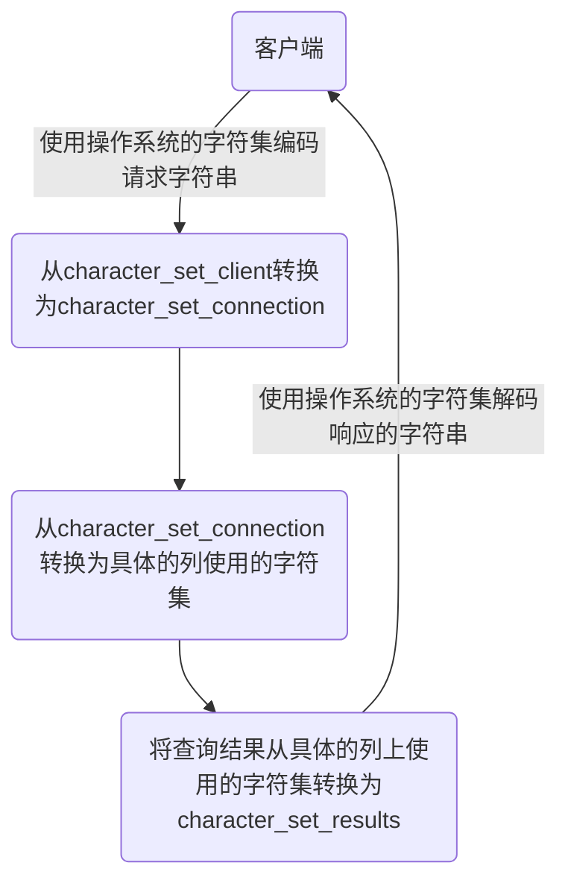

> todo 
>
> 完善这个文档，主要是具体参考的安装文档，由于安装文档还没亲自验证，所以先空着


# MySQL环境搭建

## 1. windows下

1. 停止MySQL服务
2. 卸载MySQL，清空data目录，清空注MySQL册表
3. 下载
4. 图形化安装配置
5. 编码检查

参考这个

## 2. Linux

centos7 下 MySQL8.0 脚本

[完全在线安装Mysql8/5](https://github.com/grebeci/scripts/blob/main/bigdata/hadoop/install_mysql.sh)

1. 停止MySQL服务
2. 卸载MySQL服务，删除所有和Mysql相关的（特别是my.ini
3. 更改密码，设置可以远程登录

参考这个

## 3、字符集/编码

##### **3.1** **各级别的字符集**

```mysql
show variables like 'character%';
```

- character_set_server：服务器级别的字符集
- character_set_database：当前数据库的字符集
- character_set_client：服务器解码请求时使用的字符集
- character_set_connection：服务器处理请求时会把请求字符串从character_set_client转为character_set_connection 
- character_set_results：服务器向客户端返回数据时使用的字符集

**小结**

- 如果`创建或修改列`时没有显式的指定字符集和比较规则，则该列`默认用表的`字符集和比较规则
- 如果`创建表时`没有显式的指定字符集和比较规则，则该表`默认用数据库的`字符集和比较规则
- 如果`创建数据库时`没有显式的指定字符集和比较规则，则该数据库`默认用服务器的`字符集和比较规则

##### **3.2** **请求到响应过程中字符集的变化**




##### 3.3 编码问题

Mysql5.7 （mysql8.0之前） 默认字符集为latin1，utf8字符集指向的是utf8mb3，从MySQL 8.0开始，数据库的默认编码改为`utf8mb4`。

**查看编码命令**

```shell
show variables like 'character_%';
show variables like 'collation_%';
```

注： mysql8.0 以前都要查询编码问题，Mysql8.0 之后也要确认。


MySQL5.7 可能出现中文乱码问题，需要更改字符集。

具体是：更改 `my.ini`配置，然后重启服务。


参考

[mysql设置了utf8mb4，为什么还有utf8mb4_general_ci和utf8mb4_0900_ai_ci？ - SeasonHu - 博客园 (cnblogs.com)](https://www.cnblogs.com/seasonhu/p/14994857.html)

[8.0的排序规则utf8mb4_0900_ai_ci和utf8mb4_general_ci有何区别？ - 知乎 (zhihu.com)](https://www.zhihu.com/question/521889059)
