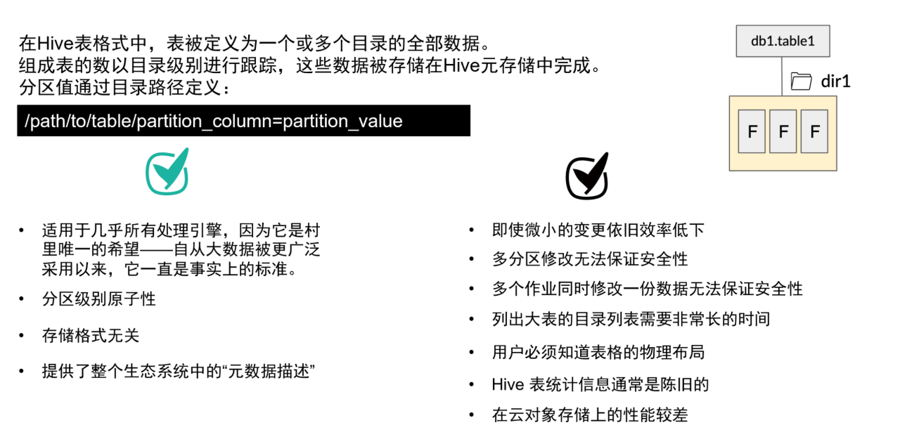
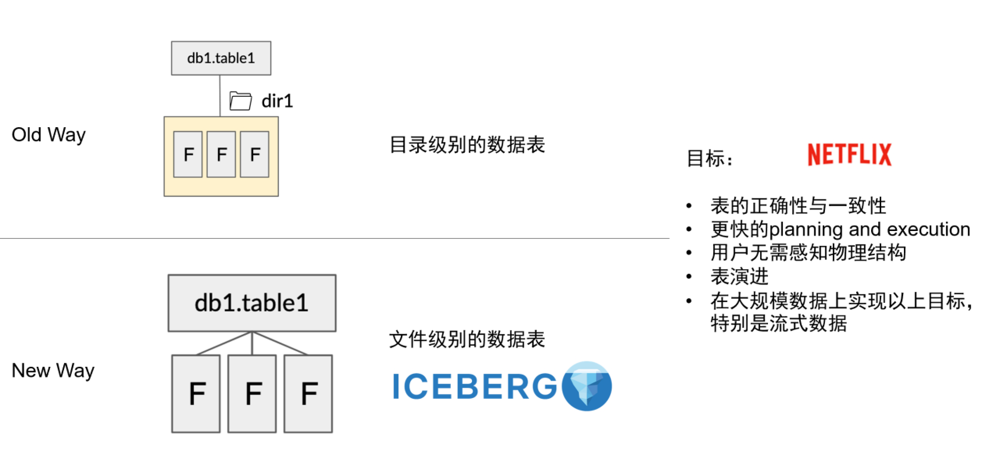

## IceBerg 产生的背景，原因和演进

`IceBerg` 源自对 `Hive` 产生问题的改进。那么 Hive 提供的功能如下和面临的问题是：

**存在的问题**

**改进为**

- 分区级别原子性 

  Hive 更新数据是全量 `Overwrite`，在写分区时候，先写入临时目录然后 MV，保证分区原子性。但是，由于 Hive Metastore 和实际的文件系统分开管理，可能会导致两者状态不一致。另外，多个作业同时写入一个分区无法保证并发安全。简单来说就是 Hive没有做 AICD的语义保证。

- Hive Metastore 没有文件级别的统计信息

  这会导致分区裁剪耗时，且只能在分区级别进行过滤下推（filter pushdown），更细的粒度上（如文件级）排除不相关的数据。

- 在云存储上性能差

  

